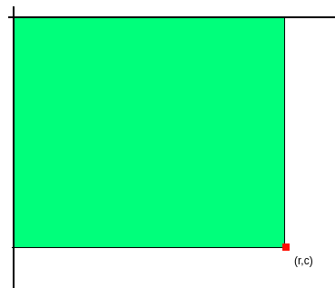
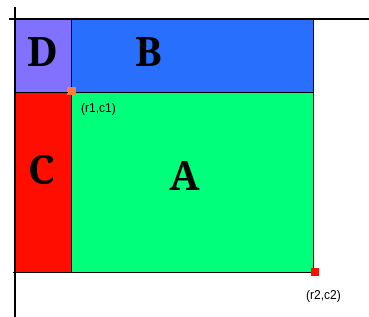

# Introducción a la solución

Tenemos una matriz $m$ de $R$ filas y $C$ columnas, donde $m[i][j]$ indica el
número de vasos de la mesa en la fila $i$ y columna $j$.

Necesitamos una forma de responder de forma eficiente a diferentes consultas
acerca del número total de vasos en diferentes conjuntos de mesas adyacentes.
Una solución naïf, para el área delimitada por $(r_1, c_1), (r_2, c_2)$ sería
iterar por todas las mesas del área, lo que tendría un coste de
$O((r_2-r_1)\cdot(c_2-c_1))$.

Esto puede ser una solución eficiente si sólo hubiese que responder una única
consulta, pero como habrá $Q$ consultas es útil precalcular ciertos valores que
nos permitan responder cada consulta más rápidamente. En concreto, podemos
construir una matriz $dp$ con las mismas dimensiones que $m$, donde $dp[i][j]$
represente el número total de vasos sumando en el área $(0,0),(i,j)$.

Una vez tengamos esta matriz, podemos consultar trivialmente la suma de todas
las mesas en $(0,0),(r_2,c_2)$:


Lo que realmente nos interesa es la suma en el área $(r_1, c_1), (r_2, c_2)$,
que podemos conseguirla sumando y restando áreas:


Llamamos:
- $A$ al área $(0,0),(r_2,c_2)$.
- $B$ al área $(0,0),(r_1,c_2)$.
- $C$ al área $(0,0),(r_2,c_1)$.
- $D$ al área $(0,0),(r_1,c_1)$.

Podemos obtener el área verde (la de nuestro interés) restando a $A$ los
valores de $B$ y $C$. El problema es que al hacer eso, estamos restando dos
veces el área $D$, cuando sólo queríamos restarla una vez, así que la añadimos.
La fórmula en general sería $A - B - C + D$.

En formulación matemática, cuidando los índices  y no acceder a posiciones
fuera de los límites:
```math
vasos_{(r_1,c_1)(r_2,c_2)} =
\left\{
\begin{array}{l}
dp[r_2][c_2]\quad\text{ si }r_1=0,c_1=0 \\
dp[r_2][c_2] - dp[r_1-1][c_2]\quad\text{ si }r_1>0,c_1=0 \\
dp[r_2][c_2] - dp[r_2][c_1-1]\quad\text{ si }r_1=0,c_1>0 \\
dp[r_2][c_2] - dp[r_1-1][c_2] - dp[r_2][c_1-1] + dp[r_1-1][c_1-1]\quad\text{ si }r_1=0,c_1>0
\end{array}
\right.
```

Una vez tenemos una forma de calcular los vasos que hay en cada área, encontrar
el área con mayor número de vasos sólo requiere llevar una cuenta del mayor
número de vasos visto hasta ahora.

# Soluciones

| Solución | Verificado con el juez |
| :------: | :--------------------: |
| [E.cpp](src/E.cpp) | :x:          |
